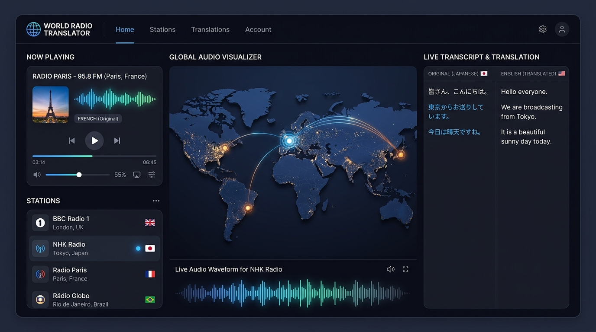

# Remix: World Radio Translator 🌍📻

Stream live radio broadcasts from anywhere in the world and translate speech in real time into your chosen target language, powered by Google Gemini AI.



---

## ✨ Features

- **🌍 Global Live Radio Streaming**: Browse, filter, and stream thousands of live radio stations worldwide across multiple genres, countries, and languages.
- **🤖 Real-Time AI Live Translation**: Translate incoming live speech into your preferred target language instantly using Google Gemini AI.
- **🎙️ Web Audio Visualizer Pipeline**: Advanced real-time frequency visualizers and volume controls built on a unified Web Audio API architecture.
- **📡 Resilient Audio Stream Proxy**: Built-in backend proxy with automatic header fallback handling to ensure high stream availability for global stations.
- **⭐ Saved Favorites & Transcripts**: Easily bookmark your favorite global stations and review past live translation transcripts.
- **📱 Clean Modern UI**: Responsive, high-contrast visual design built with React, Tailwind CSS, and Lucide Icons.

---

## 🛠️ Tech Stack

- **Frontend**: React 18, Vite, TypeScript, Tailwind CSS, Lucide React
- **Backend**: Node.js, Express, ESBuild / TSX
- **AI Integration**: Google Gen AI SDK (`@google/genai`)
- **Audio Processing**: Web Audio API, HLS.js, Custom Proxy Stream Pipeline

---

## 🚀 Getting Started

### Prerequisites

Ensure you have [Node.js](https://nodejs.org/) installed on your machine.

### Installation

1. Clone the repository or navigate to the project directory:
   ```bash
   cd remix-world-radio-translator
   ```

2. Install dependencies:
   ```bash
   npm install
   ```

3. Set up environment variables:
   Copy `.env.example` to `.env` and configure your Gemini API key:
   ```env
   GEMINI_API_KEY=your_gemini_api_key_here
   ```

4. Start the development server:
   ```bash
   npm run dev
   ```

5. Open your browser and navigate to `http://localhost:3000`.

---

## 📜 License

This project is open-source and available under the [MIT License](LICENSE).
